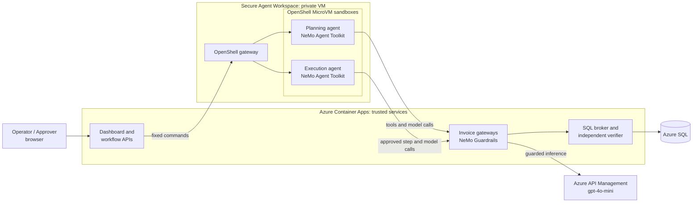

# Architecture

LearningNeMo shows how to let an AI agent do useful work on a production-like
system without giving it the authority to cause harm. The question it answers
is not only "will the model follow instructions?" but "what can the agent
actually reach or change, even when it does not follow instructions?"

The example workload is an invoice incident: duplicate imports have broken
invoice totals. A Planning agent investigates and proposes a repair; a human
approves the exact plan; an Execution agent carries it out; an independent
verifier checks the database.

## Components and the NVIDIA stack

| Layer | NVIDIA component | Role here | Page |
| --- | --- | --- | --- |
| Agent framework | NeMo Agent Toolkit | Defines and runs each agent as a YAML workflow of tools and middleware | [NeMo Agent Toolkit](nvidia/nemo-agent-toolkit.md) |
| Content screening | NeMo Guardrails | Input, output, and execution rails on every model call, run in the trusted gateway | [NeMo Guardrails](nvidia/nemo-guardrails.md) |
| Runtime isolation | OpenShell | One MicroVM sandbox per run with deny-by-default filesystem, process, and network policy | [OpenShell](nvidia/openshell.md) |
| Workspace envelope | Secure Agent Workspace reference design | Private single-owner VM, lifecycle, perimeter, and governed connectors around the runtime | [Secure Agent Workspace](nvidia/secure-agent-workspace.md) |

## Trust boundaries

No single layer is trusted to stop everything; each assumes the one inside it
may fail.

| Boundary | Enforced by | Stops |
| --- | --- | --- |
| Who is calling | Microsoft Entra roles and scopes, checked by each service | Unassigned users; a Reader executing; an Operator approving their own plan |
| What content reaches or leaves the model | NeMo Guardrails in the gateway | Prompt injection in data, leaked secrets, off-contract tool calls |
| What the agent process can touch | OpenShell policy in a MicroVM | Other hosts, other paths, other programs, writes outside `/tmp` |
| What the workspace can reach | NSG rules on the VM subnet | Inbound traffic, the trusted network, direct SQL, instance metadata |
| What may change | SQL broker with the exact approved plan hash | Any step not in the approved plan, replayed steps, changed parameters |
| Whether it worked | Independent verifier | A model or agent claiming success without the database agreeing |

## One invoice incident, end to end

1. **Scenario.** The Operator creates a scenario in the dashboard.
2. **Planning run.** The controller asks the VM to prepare a fresh Planning
   sandbox, registers the run in SQL (sandbox ID, policy hash, capability
   hash), and starts the NAT Planning agent in it.
3. **Investigate.** The agent calls `invoice_summary` and `invoice_batches`
   through the Planning gateway. Each model call passes the gateway's rails.
4. **Propose.** The agent publishes a structured decision. Its steps must
   match the contract and target the admitted scenario.
5. **Approve.** The Approver, a different Entra identity, reviews and approves
   the exact plan hash within the review window.
6. **Execution run.** A new sandbox, never the Planning one, runs the NAT
   Execution agent. It may only request the next exact approved step; the
   broker checks each against the plan and records a receipt.
7. **Verify.** The independent verifier checks the database. The run's
   authority is revoked and the sandbox is stopped and retained for evidence.

## Where things live

| Area | Location |
| --- | --- |
| Agents and tools | [`src/task_agent/`](../src/task_agent/README.md), [`configs/`](../configs) |
| Sandbox policies and provider profiles | [`infra/next-phase/openshell/`](../infra/next-phase/openshell) |
| Azure infrastructure | [`infra/next-phase/`](../infra/next-phase/README.md) |
| Container images | [`containers/`](../containers/README.md) |
| Design decisions | [`docs/decisions/`](decisions/0001-openshell-microvm-driver.md) |
| Target-state specification | [`docs/specification/`](specification/next-phase-saw-openshell-spec.md) |
