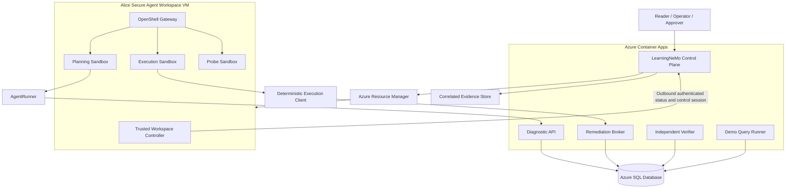

# LearningNeMo Next Phase Specification

## Secure Agent Workspace, OpenShell, and Azure SQL Incident Response

| Field | Value |
| --- | --- |
| Status | Proposed target-state specification |
| Audience | Implementers, security reviewers, and hiring reviewers |
| Target environment | Microsoft Azure development subscription |
| Primary scenario | Diagnose, contain, remediate, verify, and close a recursive-query incident |
| Runtime model | One single-user SAW VM with multiple OpenShell sandboxes |
| Current maturity | Pre-SAW application-security baseline |
| Last reviewed | 2026-09-12 |

## 1. Purpose

This specification defines the next phase of LearningNeMo. The phase extends the
existing Reader and Operator authorization demonstration into a governed agent
incident-response workflow that demonstrates:

- human identity and separation of duties;
- logical agent and runtime identity;
- bounded delegation and approval;
- NeMo Guardrails around untrusted content and tool use;
- OpenShell runtime policy and containment;
- a Secure Agent Workspace (SAW) on Microsoft Azure;
- brokered, least-privilege access to Azure SQL;
- deterministic verification before task completion; and
- correlated evidence from every enforcement layer.

The target demonstration is not successful merely because an agent produces a
correct answer. It is successful only when the system proves that an autonomous
agent could perform useful analysis without acquiring unrestricted database,
network, filesystem, credential, or lifecycle authority.

## 2. Normative Language

The words **MUST**, **MUST NOT**, **SHOULD**, **SHOULD NOT**, and **MAY** describe
requirements for this phase.

## 3. Executive Design Decision

LearningNeMo will use a hybrid Azure design:

- Trusted APIs and deterministic services run in Azure Container Apps.
- One Azure Linux VM is provisioned for one human Operator and one engagement.
- The VM is the outer, single-user Secure Agent Workspace boundary.
- One OpenShell gateway inside the VM manages multiple short-lived sandboxes.
- AgentRunner performs diagnosis and planning in a Planning Sandbox.
- An approved operation runs in a fresh Execution Sandbox.
- A Probe Sandbox produces explicit OpenShell denial evidence.
- AgentRunner never connects directly to Azure SQL.
- A deterministic Remediation Broker performs registered SQL operations using
  its own managed identity.
- An independent Verifier decides whether remediation succeeded.



## 4. Current State and Required Change

The current LearningNeMo workflow has two task states, `pending` and
`completed`. Its `execute_task` operation immediately changes a task to
`completed`. That model cannot honestly represent diagnosis, approval,
execution, verification, or incident closure.

The repository began as a secured local application baseline. It now contains
deployed WP1 networking, a cost budget, six WP2a-I identities, an on-demand
VNet-integrated Container Apps runtime, an Entra-only free-limit Azure SQL base,
an approved SQL private endpoint and DNS overlay, and an IaC-managed Basic ACR.
The trusted worker image is digest-pinned, SBOM-scanned with zero High or
Critical findings, and bound to detached Cosign and source-revision evidence.
Hash-bound SQL migration and SQL-backed worker IaC is implemented; workload
capability is not claimed until migration and live worker verification pass.
The SAW VM and OpenShell remain planned work. Requirements in this document
describe the target state delivered incrementally by the work packages in
Section 23. A missing target component is planned work, not evidence that it
already exists.

The project MUST describe only the maturity level it has actually reached. A
work package MUST NOT change the public capability claim until its exit criteria
and applicable negative tests pass.

The next phase MUST split the current operation into explicit commands:

```text
diagnose_incident
contain_query_run
propose_resolution
approve_resolution
reject_resolution
execute_approved_resolution
verify_resolution
complete_task
```

Approval, execution triggering, and task completion MUST be explicit control
plane actions. They MUST NOT be inferred from conversational model output.

## 5. Terminology

### 5.1 Secure Agent Workspace

Secure Agent Workspace is an NVIDIA enterprise reference architecture and
operating model, not a single installable product. In this specification, SAW
means the complete managed boundary around autonomous work:

- one human owner or sponsor;
- one isolated VM or micro-VM trust boundary;
- approved image and lifecycle management;
- enterprise SSO and brokered access;
- default-deny network reachability;
- external lifecycle and security audit;
- bounded agent delegation; and
- a kill switch that the agent cannot control.

The SAW VM is the long-lived engagement boundary. For this portfolio phase,
"long-lived" means the duration of one demonstration engagement, not a
permanent server.

### 5.2 OpenShell

OpenShell is the in-workspace runtime used to create and govern agent
sandboxes. It supplies the inner enforcement boundary for:

- process identity and syscall restrictions;
- filesystem read and write policy;
- network destination, port, and application-layer policy;
- credential mediation;
- routed inference;
- sandbox lifecycle; and
- runtime security logs.

OpenShell does not provide human business approval, Azure resource lifecycle,
or multi-user VM isolation.

### 5.3 Workspace and Sandbox

These terms MUST NOT be used interchangeably:

| Concept | Lifetime | Boundary | Owner |
| --- | --- | --- | --- |
| SAW VM | Hours or engagement duration | One human trust domain | Platform control plane |
| OpenShell Planning Sandbox | Minutes or hours | One planning session | OpenShell gateway |
| OpenShell Execution Sandbox | Seconds or minutes | One approved operation | OpenShell gateway |
| OpenShell Probe Sandbox | Seconds or minutes | One adversarial test | OpenShell gateway |

Multiple OpenShell sandboxes MAY run sequentially or concurrently in Alice's
VM because they belong to the same user and engagement. Alice and Bob MUST NOT
share a normal VM when cross-user isolation is claimed. Bob requires a separate
VM or micro-VM boundary.

### 5.4 AgentRunner

AgentRunner is the logical, non-human agent identity associated with one
engagement. A runtime AgentRunner instance executes in a specific OpenShell
sandbox under a short-lived capability that resolves to:

```text
human sponsor
workspace
logical agent
sandbox runtime
task
permitted tools and resources
expiration
approval mode
revocation reference
```

AgentRunner MUST NOT be treated as equivalent to the human Operator.

### 5.5 Remediation Broker

The Remediation Broker is a deterministic trusted service. It is not an LLM
agent. It validates an approved operation and invokes a narrowly granted Azure
SQL stored procedure using its own managed identity.

### 5.6 Engagement

An engagement binds one incident, one human sponsor, one SAW VM, one logical
agent registration, the associated OpenShell sandboxes, and one audit chain.

## 6. When To Use SAW and OpenShell

### 6.1 Use Secure Agent Workspace When

SAW SHOULD be used when an autonomous agent:

- executes shell commands, scripts, hooks, MCP servers, or generated code;
- retains files or agent state across multiple operations;
- uses internal data or enterprise services;
- runs for an extended session or without continuous human supervision;
- requires a revocable, attributable human sponsor;
- needs a workspace kill switch outside the agent's control; or
- could affect other users if a container or runtime sandbox escapes.

SAW supplies the outer blast-radius boundary and managed lifecycle. It answers:

> If the agent compromises its runtime or workspace operating system, what
> remains isolated, observable, and revocable?

### 6.2 Do Not Use SAW As A Service Hosting Platform

SAW SHOULD NOT host the shared LearningNeMo web application, broker, verifier,
or other multi-user APIs. Those components belong on a service-hosting platform
such as Azure Container Apps.

SAW MAY be unnecessary when a component is deterministic, stateless, accepts
strictly typed requests, executes no arbitrary code, and has no user-controlled
filesystem or shell. The Remediation Broker is such a component.

### 6.3 Use OpenShell When

OpenShell SHOULD be used whenever an agent process can:

- run code or shell commands;
- manipulate workspace files;
- invoke MCP servers or tools;
- consume untrusted retrieved content;
- make network requests;
- use model or service credentials; or
- launch child processes.

OpenShell answers:

> What can this specific agent process read, write, execute, call, and receive
> as a credential right now?

### 6.4 OpenShell Without SAW

OpenShell MAY run locally with Docker, Podman, or a micro-VM for development,
policy authoring, and single-user testing. That demonstrates OpenShell, but it
MUST NOT be described as a deployed Secure Agent Workspace unless the managed
workspace, identity, lifecycle, network perimeter, and audit controls also
exist.

### 6.5 SAW Without OpenShell

A single-user VM with approved images, brokered access, egress controls, and a
kill switch can demonstrate a Phase I managed workspace. It does not provide
the in-runtime tool, filesystem, process, or credential controls expected from
OpenShell in Phase II.

### 6.6 Use Both When

SAW and OpenShell SHOULD be combined when an autonomous agent handles private
data while also executing tools or accessing external services.

```text
SAW VM       -> isolates one human engagement from other users and networks
OpenShell    -> constrains the agent process inside that VM
Guardrails   -> evaluates semantic intent and untrusted content
Authorization-> evaluates human and workload permissions
Approval     -> authorizes an exact critical business change
Broker       -> performs one registered privileged operation
Verifier     -> proves the resulting state independently
```

No item in this list replaces another.

## 7. Scope

### 7.1 In Scope

- Azure infrastructure defined with Bicep.
- A trusted platform network and a dedicated untrusted SAW network.
- Azure Container Apps for shared trusted services.
- One Azure SQL logical server and one development database.
- Separate `control`, `lab`, and `ops` database schemas.
- One ephemeral Azure Linux VM for Operator Alice.
- One OpenShell gateway and multiple OpenShell sandboxes in that VM.
- Reader, Operator, and Approver human roles.
- One logical AgentRunner identity and runtime capabilities.
- Managed identities for trusted Azure services.
- A controlled recursive-query incident.
- Immediate containment and approved permanent remediation.
- Expanded NeMo Guardrails.
- Structured, correlated evidence and negative tests.
- Optional temporary Bob VM for cross-user isolation evidence.

### 7.2 Out of Scope

- A production multi-subscription SAW fleet.
- General-purpose database administration by an LLM.
- Arbitrary SQL execution.
- A permanent privileged `KILL DATABASE CONNECTION` grant.
- GPU inference inside the workspace.
- Full ODIS conformance certification.
- Production corporate-network connectivity.
- Confidential-compute attestation.
- A claim that Azure schemas isolate database compute resources.
- A claim that local OpenShell alone is a complete SAW deployment.

## 8. Human and Workload Actors

| Actor | Type | Responsibilities | Prohibited authority |
| --- | --- | --- | --- |
| Reader | Human | Inspect tasks and redacted evidence | Diagnose, contain, approve, execute, verify, complete |
| Operator Alice | Human | Sponsor engagement, diagnose, contain, propose, trigger, complete | Approve own critical plan, access SQL directly |
| Approver | Human | Approve or reject exact permanent-fix plan | Execute remediation, complete task |
| Operator Bob | Human, optional | Prove same-role cross-workspace isolation | Access Alice's workspace or grants |
| AgentRunner | Logical agent | Analyze evidence, run local tools, produce structured plan | Approve, change policy, connect to SQL, complete task |
| Workspace Controller | Trusted workload | Provision VM and manage OpenShell lifecycle | Agent reasoning or SQL remediation |
| Demo Query Runner | Trusted workload | Start and own controlled recursive query | General task or control-schema mutation |
| Diagnostic API | Trusted service | Return bounded, redacted diagnostic data | SQL mutation |
| Remediation Broker | Trusted service | Execute registered approved SQL operations | Arbitrary SQL or plan generation |
| Verifier | Trusted service | Perform deterministic recovery checks | Remediation or completion |

## 9. Authorization Model

### 9.1 Human App Roles

The Entra API application MUST expose:

```text
Task.Reader
Task.Operator
Task.Approver
Demo.Admin
```

The existing shared public client MAY continue requesting delegated scopes.
App roles MUST remain the user-specific authorization boundary.

Recommended scopes:

```text
agent.invoke
tasks.read
tasks.operate
tasks.approve
demo.admin
```

`tasks.execute` MAY be retained temporarily for backward compatibility, but
new tools SHOULD use the narrower operation names.

### 9.2 Role Rules

- Every Operator MUST also have `Task.Reader`.
- Approver MAY also have `Task.Reader` but MUST NOT require `Task.Operator`.
- The same human MUST NOT approve and trigger the same critical plan.
- `Demo.Admin` MUST own fixture reset and incident startup.
- `reset_tasks` MUST be removed from normal Operator authority.
- Server-owned workflow steps MUST continue to derive from verified roles.

### 9.3 Workload Authority

Human app roles MUST NOT be copied into an AgentRunner workload token as if the
agent were the human. AgentRunner authority MUST be derived from a signed,
short-lived delegation or capability that can only narrow the human sponsor's
authority.

The effective decision for an approved operation is:

```text
human Operator authorization
AND valid logical AgentRunner registration
AND matching workspace and sandbox runtime
AND valid Approver receipt
AND unchanged plan hash
AND one-time execution grant
AND OpenShell policy allow
AND Broker operation allowlist
```

## 10. Azure Resource Topology

### 10.1 Resource Groups

The Bicep deployment SHOULD separate stable platform resources from disposable
workspace resources:

```text
rg-learningnemo-platform-<env>
rg-learningnemo-saw-<env>
```

The SAW resource group MUST support engagement cleanup without deleting Azure
SQL, Container Apps, Key Vault, APIM, or the audit store.

### 10.2 Required Resource Providers

The deployment preflight MUST verify registration for the resource providers
used by the selected design, including:

```text
Microsoft.App
Microsoft.Compute
Microsoft.ContainerRegistry
Microsoft.KeyVault
Microsoft.ManagedIdentity
Microsoft.Network
Microsoft.OperationalInsights
Microsoft.Sql
Microsoft.Storage
```

### 10.3 Trusted Platform Resources

The platform resource group SHOULD contain:

- Azure Container Registry;
- Azure Container Apps environment;
- LearningNeMo control plane;
- Diagnostic API;
- Remediation Broker;
- independent Verifier;
- Demo Query Runner job;
- Azure SQL logical server and database;
- Key Vault;
- existing or imported APIM model gateway;
- Log Analytics workspace;
- managed identities; and
- private endpoints and private DNS where selected.

### 10.4 SAW Resources

The SAW resource group SHOULD contain:

- dedicated untrusted VNet;
- workspace subnet;
- firewall subnet and firewall resources in the reference-aligned profile;
- network security groups and route tables;
- ephemeral VM, NIC, and OS disk;
- workspace policy and image metadata; and
- temporary engagement diagnostics that are safe to delete.

## 11. Network Requirements

### 11.1 Network Separation

The design MUST use distinct trust zones:

```text
Trusted platform zone -> Container Apps, SQL private access, Key Vault
Untrusted SAW zone    -> ephemeral user VM and autonomous agent runtime
External model zone   -> APIM-approved inference endpoint
```

The SAW VNet MUST NOT be peered to a trusted corporate hub for this portfolio
phase. The SAW VM MUST NOT have a public IP.

### 11.2 Example Address Plan

All address ranges MUST be parameters and MUST be checked for overlap before
deployment. Example development ranges are:

| Network | Example CIDR | Purpose |
| --- | --- | --- |
| Platform VNet | `10.40.0.0/16` | Trusted APIs and private endpoints |
| Container Apps subnet | deployment-specific | Delegated infrastructure subnet |
| Private endpoint subnet | `10.40.20.0/24` | SQL, Key Vault, ACR as required |
| SAW untrusted VNet | `10.50.0.0/16` | Disposable workspace VMs |
| SAW workspace subnet | `10.50.10.0/24` | Alice and optional Bob VMs |
| AzureFirewallSubnet | `10.50.255.0/26` | Reference-aligned perimeter |

The exact Container Apps subnet size MUST be validated against current Azure
Container Apps requirements before deployment.

### 11.3 SAW Egress

Runtime egress MUST be deny-by-default at both layers:

1. Azure network perimeter; and
2. OpenShell runtime policy.

The allowlist SHOULD be limited to:

- Entra/OIDC token endpoints required by the architecture;
- the APIM model gateway;
- LearningNeMo Diagnostic API;
- LearningNeMo Remediation Broker during approved execution only;
- required OpenShell gateway/control endpoints; and
- approved telemetry destinations.

Direct Azure SQL access from the SAW VM and every OpenShell sandbox MUST be
denied. SQL access MUST originate from trusted Container Apps identities.

### 11.4 Bootstrap and Runtime Policies

Bootstrap may require access to package or image registries. Bootstrap and
runtime MUST use different policies:

- Bootstrap policy MAY permit approved package and image sources.
- Runtime policy MUST remove bootstrap-only destinations before AgentRunner
  starts.
- The broad bootstrap managed identity MUST be detached or replaced by a
  narrow runtime identity before untrusted agent code starts.

### 11.5 DNS and Metadata

- Direct outbound DNS SHOULD be blocked in the reference-aligned profile.
- DNS SHOULD use the controlled platform resolver or firewall DNS proxy.
- OpenShell sandboxes MUST NOT reach Azure Instance Metadata Service.
- The VM host MAY use managed identity, but its token endpoint MUST remain
  outside the agent sandbox policy.

### 11.6 Container Apps Ingress

For the first portfolio implementation, AgentRunner-facing APIs MAY use public
HTTPS ingress protected by Entra workload authentication, strict audience and
client validation, and firewall/OpenShell FQDN allowlists.

Private ingress MAY be introduced later, but every Private Endpoint bypass of
the normal firewall route MUST be documented and observed through resource
firewalls plus NSG/VNet flow logs.

## 12. Secure Agent Workspace Requirements

### 12.1 Workspace Boundary

- Each VM MUST have exactly one human owner for the engagement.
- The VM MUST be ephemeral and disposable.
- The VM MUST be created from an approved, versioned image.
- The VM MUST have no public IP and no direct inbound administrative path.
- Interactive access MUST ultimately use Entra-backed brokered sessions.
- The control plane MUST own create, start, stop, revoke, and delete actions.
- AgentRunner MUST NOT call Azure Resource Manager to alter its VM.
- The control plane MUST use Azure Resource Manager for VM lifecycle and MUST
  NOT initiate an inbound management connection to the private VM.
- The Workspace Controller and OpenShell supervisor MUST establish outbound,
  authenticated control and status sessions to approved endpoints.
- Idle and maximum-lifetime policies MUST terminate stale workspaces.
- A platform kill switch MUST stop the VM and revoke the active engagement.

### 12.2 Portfolio Claim Levels

The project MUST describe its maturity honestly:

| Implemented controls | Permitted claim |
| --- | --- |
| Local OpenShell only | Local OpenShell policy demonstration |
| Managed single-user Azure VM plus lifecycle, SSO, and network controls | SAW Phase I portfolio POC |
| Phase I plus in-VM OpenShell and credential mediation | SAW Phase II portfolio POC |
| Temporary second VM and same-role denial | Cross-user SAW isolation verified |

The project MUST NOT claim a production SAW fleet.

### 12.3 Workspace Lifecycle

```text
requested
-> provisioning
-> bootstrapping
-> runtime_identity_ready
-> ready
-> engaged
-> revoking
-> deleted
```

Readiness MUST be based on control-plane-owned evidence such as ARM state,
attested tags, and the OpenShell supervisor connection. The control plane MUST
be restart-safe and MUST NOT create duplicate VMs after a deployment worker
restart.

### 12.4 Multiple Sandboxes

One Alice VM MAY host:

```text
planning-<engagement-id>
execution-<execution-id>
probe-<test-run-id>
```

The gateway MUST enforce quotas for sandbox count, CPU, memory, and lifetime.
Sandbox creation MUST remain a control-plane action. AgentRunner MUST NOT access
the OpenShell administrative token, gateway state database, or Podman/Docker
socket.

## 13. OpenShell Requirements

### 13.1 Gateway Placement

The OpenShell gateway SHOULD run as a platform-controlled host service in the
SAW VM. The implementation SHOULD prefer rootless Podman when all required
OpenShell policy behavior is verified. Docker MAY be used for an initial spike,
but the agent sandbox MUST never receive the Docker socket.

The compute-driver choice MUST be recorded in an architecture decision record.

### 13.2 Planning Sandbox Policy

The Planning Sandbox MUST:

- run AgentRunner as a restricted process;
- mount only the engagement workspace as writable;
- mount policy, agent configuration, hooks, and system files read-only or deny
  access entirely;
- permit the approved model/inference route;
- permit the Diagnostic API;
- deny the Remediation Broker;
- deny direct Azure SQL, IMDS, general internet, and host services;
- use bounded CPU, memory, process count, and command duration;
- emit policy decisions and lifecycle logs; and
- receive no reusable raw service credential.

AgentRunner MAY:

- analyze redacted incident evidence;
- execute approved local Python and shell analysis tools;
- write diagnosis and plan artifacts under the engagement workspace;
- evaluate hierarchy cycles against a local synthetic fixture; and
- submit a structured plan to LearningNeMo.

### 13.3 Execution Sandbox Policy

The Execution Sandbox MUST be created only after approval and an Operator
trigger. It MUST:

- start from a clean sandbox instance;
- mount the canonical approved plan read-only;
- receive one short-lived, single-use execution capability;
- run a deterministic execution client, not an unrestricted LLM loop;
- permit only the exact Remediation Broker host, method, and path;
- deny model inference, Diagnostic API, direct SQL, IMDS, and general internet;
- terminate after one operation; and
- purge runtime credentials when deleted.

The Planning Sandbox policy MUST NOT be widened in place to create execution
authority.

### 13.4 Probe Sandbox Policy

The Probe Sandbox exists to generate visible containment evidence. It SHOULD
attempt:

- direct TCP access to Azure SQL on port 1433;
- HTTPS access to an unapproved external endpoint;
- access to Azure IMDS;
- reads of host SSH, cloud, and OpenShell administrative files;
- writes to agent hooks, startup files, and policy files;
- privilege escalation; and
- an unapproved Remediation Broker route.

Every attempt MUST fail for the intended policy reason. The probe MUST NOT use
real secrets or production destinations.

### 13.5 Policy Governance

- Policies MUST be versioned and immutable after release.
- Every policy MUST have a stable content hash.
- The active policy hash MUST be visible in LearningNeMo evidence.
- Dynamic policy updates MUST use the OpenShell policy API, not an assumption
  that changing a mounted YAML file changes enforcement.
- The agent MUST NOT be able to update or sign its own policy.
- Static filesystem and process policy changes MUST recreate the sandbox.
- Policy rollback MUST be tested.

## 14. Azure Container Apps Requirements

The following components SHOULD run as separate Container Apps or jobs:

| Component | Runtime type | Azure SQL authority |
| --- | --- | --- |
| LearningNeMo control plane | Long-running app | `control` workflow procedures |
| Diagnostic API | Long-running app | Read-only diagnostic procedures/views |
| Remediation Broker | Long-running app | Registered remediation procedures only |
| Verifier | App or job | Verification procedures/views only |
| Demo Query Runner | Job | Start/cancel owned lab fixture only |

Each service MUST have:

- an independently assignable managed identity;
- a distinct Azure SQL contained user or database role;
- an immutable image digest for release deployments;
- health and readiness probes;
- structured logs with correlation fields;
- no unnecessary shell or package manager in the runtime image; and
- no shared database password.

The trusted services MUST NOT run inside an agent-controlled OpenShell sandbox.

## 15. Azure SQL Requirements

### 15.1 Database Layout

One Azure SQL database is acceptable for this controlled portfolio lab. It MUST
use separate schemas:

```text
control.*  task, engagement, plan, approval, execution, and evidence state
lab.*      recursive hierarchy fixture and query-run state
ops.*      restricted diagnostic, remediation, and verification interfaces
```

This is an authorization separation, not a compute-isolation boundary. The
documentation MUST state that a production control plane would normally use a
different failure domain from the database it remediates.

### 15.2 Required Records

At minimum, the database MUST represent:

```text
control.Tasks
control.TaskEvents
control.Engagements
control.AgentRegistrations
control.ResolutionPlans
control.Approvals
control.Executions
control.Verifications
control.EvidenceEvents
lab.HierarchyEdges
lab.QueryRuns
lab.QueryVersions
```

Mutable aggregate roots MUST use `rowversion` or an equivalent optimistic
concurrency mechanism. State changes and their corresponding event records MUST
commit in the same transaction.

### 15.3 Database Principals

The deployment MUST define narrowly scoped database roles or grants for:

```text
learningnemo_control
learningnemo_diagnostic
learningnemo_remediator
learningnemo_verifier
learningnemo_query_runner
```

These principals SHOULD receive `EXECUTE` on named procedures and `SELECT` on
safe views rather than broad `db_datareader`, `db_datawriter`, or `db_owner`
membership.

Humans and AgentRunner MUST NOT receive direct Azure SQL credentials.

### 15.4 Recursive-Query Fixture

The controlled hierarchy MUST include a cycle such as:

```text
A -> B -> C -> A
```

The unsafe fixture MAY use `OPTION (MAXRECURSION 0)` only when all of the
following are true:

- it is a read-only `SELECT`;
- it runs on a dedicated connection owned by Demo Query Runner;
- `MAXDOP 1` is applied;
- a hard command timeout exists;
- an independent watchdog exists;
- no surrounding transaction exists;
- the database is not shared with production or unrelated workloads; and
- automatic cleanup is tested before the live demonstration.

Azure SQL normally limits recursion to 100. `MAXRECURSION 0` removes that
protection and MUST NOT appear in general application queries.

The watchdog MUST NOT depend on the event loop or process that is blocked on the
recursive query. It SHOULD run as a separately scheduled control-plane job. On
expiry it MUST terminate the registered Query Runner job replica or revoke its
lease, causing the owned SQL connection to close and the query to cancel. The
cleanup path MUST verify that the registered run is no longer active.

### 15.5 Cancellation

The first implementation MUST use cooperative cancellation by the Demo Query
Runner that owns the connection. AgentRunner supplies a registered `run_id`,
not a database session ID.

The system MUST NOT grant AgentRunner `KILL DATABASE CONNECTION` or expose a
generic `KILL <session_id>` tool. A privileged fallback is out of scope until a
separate security review demonstrates that it is necessary and safely bound to
connection identity, query hash, application name, run ownership, and time.

### 15.6 Permanent Remediation

Stopping the query is containment, not resolution. The permanent remediation
MUST activate a registered cycle-safe query version that includes:

- explicit path-based cycle detection or equivalent;
- a finite recursion limit as defense in depth;
- deterministic expected output; and
- a registered rollback version.

The Remediation Broker MUST select a reviewed operation by ID. It MUST NOT
execute arbitrary SQL emitted by the model.

## 16. Incident Workflow

### 16.1 Lifecycle Records

Different concerns MUST have different lifecycles:

```text
Task:         open -> contained -> remediated -> verified -> completed
QueryRun:     starting -> running -> cancel_requested -> cancelled | failed
Plan:         draft -> awaiting_approval -> approved | rejected | expired -> consumed
Execution:    queued -> running -> succeeded | failed
Verification: pending -> passed | failed
Workspace:    requested -> provisioning -> ready -> engaged -> revoking -> deleted
Sandbox:      provisioning -> ready -> stopped | deleted | error
```

Diagnosis SHOULD be an immutable report or event rather than a long-lived task
state.

### 16.2 Main Demonstration

1. `Demo.Admin` starts the controlled recursive-query run.
2. Reader views redacted incident evidence.
3. Reader attempts containment and receives `403 authorization_denied`.
4. Operator Alice starts an engagement.
5. The control plane provisions Alice's SAW VM and Planning Sandbox.
6. AgentRunner retrieves a bounded diagnostic package.
7. NeMo Guardrails identifies malicious instructions in retrieved incident
   text.
8. AgentRunner runs local cycle analysis and writes a structured diagnosis.
9. Operator invokes the predefined containment runbook.
10. Demo Query Runner cooperatively cancels its registered connection.
11. AgentRunner produces a canonical permanent-resolution plan and rollback.
12. LearningNeMo hashes and stores the plan.
13. Approver reviews and approves the exact plan hash.
14. Operator explicitly triggers execution.
15. The control plane creates a fresh Execution Sandbox.
16. The deterministic client submits the one-time grant to Remediation Broker.
17. Broker activates the registered safe query version.
18. Verifier checks recovery independently.
19. Operator explicitly marks the verified task completed.
20. Evidence is exported, sandboxes are deleted, and the SAW VM is destroyed.

### 16.3 Completion Rule

`complete_task` MUST require a successful verification record that matches:

```text
task_id
execution_id
plan_hash
safe_query_version
verification_profile
workspace_id
```

The model's statement that remediation succeeded MUST never satisfy this rule.

## 17. Approval Requirements

The permanent remediation is a critical write and MUST require human approval.
The approval record MUST bind:

```text
task_id
engagement_id
workspace_id
logical_agent_id
plan_id
plan_hash
operation_id
target_database_resource
safe_query_version
approved_by
approved_at
expires_at
one_time_id
consumed_at
```

Approval MUST fail when:

- plan content or hash changes;
- the target task, workspace, agent, or operation changes;
- the Approver is also the triggering Operator;
- the approval has expired;
- the approval has already been consumed;
- the task is no longer in an approvable state; or
- the requested execution capability is broader than the plan.

Immediate containment of the exact registered lab query MAY use a preapproved
runbook and Operator authority because leaving a runaway query active while
waiting for permanent-change approval is poor incident response.

## 18. Guardrails Requirements

The current jailbreak-detection and PII-masking behavior MUST be retained. The
implementation MAY change when an executable evaluation demonstrates equal or
better behavior. The next phase MUST add controls around the complete agent
workflow:

### 18.1 Human Input

- Detect direct jailbreak and policy-bypass attempts.
- Mask configured PII before model processing.
- Reject attempts to select another user's persona or workspace.

The selected ACA implementation is hybrid and reuses the existing APIM/OpenAI
gateway rather than deploying guardrail-specific compute:

1. authenticate the Entra caller;
2. mask configured PII locally with Presidio and spaCy;
3. submit only the sanitized prompt to a dedicated APIM guardrail operation;
4. run the strict NAT semantic middleware against a tool-free `gpt-4o-mini`
  classifier request;
5. continue to the agent model only on an explicit safe verdict.

The APIM operation MUST inherit the gateway credential policy, use the same
approved OpenAI backend, force temperature `0`, cap output at three tokens,
disable streaming, and remove tool and function fields. Its operation identity
MUST remain distinct for telemetry. Unrecognized verdicts and transport errors
MUST fail closed. This semantic classification is an additional model call and
therefore has latency and token cost; it MUST NOT be presented as an
authorization boundary.

### 18.2 Retrieved Diagnostic Content

- Label database notes and diagnostic artifacts as untrusted data.
- Detect indirect prompt injection.
- Prevent retrieved content from granting new tools or destinations.
- Preserve the original evidence for audit without feeding unsafe instructions
  back as trusted system direction.

### 18.3 Tool and Plan Validation

- Permit only registered tool names.
- Validate every argument against strict schemas.
- Reject raw SQL, raw session IDs, shell interpolation, and unknown URLs.
- Compare the proposed operation to the task's allowed remediation catalog.
- Canonicalize plan data before hashing.

### 18.4 Tool Output and Final Response

- Inspect results for credentials, tokens, connection strings, and PII.
- Prevent the model from claiming execution, verification, or completion when
  no corresponding receipt exists.
- Include evidence references rather than raw privileged output.

### 18.5 Evaluation

The project MUST include an evaluation dataset containing allowed and denied
examples for:

- normal diagnosis;
- direct jailbreak;
- indirect injection;
- plan expansion;
- arbitrary SQL;
- unauthorized destination;
- false success claim; and
- sensitive output leakage.

Results SHOULD report decision accuracy, false positives, false negatives, and
latency. Guardrails MUST NOT be presented as an authorization boundary.

## 19. Identity and Credential Requirements

### 19.1 Human Identity

- Humans authenticate through Microsoft Entra ID.
- The API validates issuer, signature, audience, lifetime, calling client,
  subject, delegated scopes, and app roles.
- Existing 15-minute maximum token age SHOULD remain for the portfolio console.
- Browser tokens MUST remain in isolated server-side sessions.

### 19.2 Control Plane Identity

The workspace provisioner MUST use a secretless Azure identity. When running in
Container Apps, a user-assigned managed identity MAY be used instead of storing
an Azure client secret.

Its Azure RBAC role MUST be custom and scoped to required SAW lifecycle
operations in the disposable resource group.

### 19.3 Workspace Identity

The VM SHOULD use separate bootstrap and runtime managed identities:

- Bootstrap identity: temporary image, policy, and initialization access.
- Runtime identity: minimal fixed authority required by the workspace
  controller after agent startup.

The bootstrap identity MUST be removed or replaced before AgentRunner starts.

### 19.4 Agent Identity

LearningNeMo MUST register a logical AgentRunner and issue or mediate a
short-lived runtime capability for each sandbox. The capability MUST be bound
to the human sponsor, workspace, sandbox, task, permitted APIs, and duration.

Raw VM managed-identity tokens MUST NOT be made available to AgentRunner.
OpenShell credential mediation or a separate proxy outside the sandbox SHOULD
acquire and attach service tokens only for approved requests.

The exact Entra-to-OpenShell token mediation mechanism is an implementation
spike and release gate. If it cannot keep tokens outside the agent process, the
design MUST use an out-of-sandbox credential proxy rather than exposing IMDS.

### 19.5 Broker Identity

Remediation Broker MUST use its own managed identity to connect to Azure SQL.
The identity MUST have only the registered remediation procedure grants.

### 19.6 OBO

OAuth On-Behalf-Of SHOULD be used only if a downstream business API must
authorize directly as the human Operator. OBO MUST NOT be introduced merely to
claim agent identity, and a human token MUST NOT be used as the Azure SQL
credential.

## 20. Evidence and Audit Requirements

Every relevant event MUST include safe correlation fields:

```text
request_id
engagement_id
task_id
human_subject_hash
human_role
logical_agent_id
workspace_id
sandbox_id
policy_hash
plan_hash
approval_id
execution_id
verification_id
resource
decision
reason_code
timestamp
```

Evidence MUST be emitted by the layer making the decision:

| Layer | Required evidence |
| --- | --- |
| Entra/LearningNeMo | Human authentication and role decision |
| SAW control plane | VM lifecycle, owner binding, identity swap, kill switch |
| OpenShell | Sandbox lifecycle and allow/deny policy decision |
| Guardrails | Rail name, decision, safe reason, latency |
| Broker | Capability, approval, operation, and replay decision |
| Azure SQL | Managed-identity procedure execution and result |
| Verifier | Individual checks and aggregate pass/fail |
| Operator | Explicit completion action |

LearningNeMo MAY present these events in one timeline, but MUST label evidence as
configured, observed, or independently verified. It MUST NOT synthesize a
successful OpenShell, Azure SQL, or SAW result that was not observed.

Production alignment SHOULD target OCSF-compatible events and a SIEM. The first
portfolio implementation MAY use structured JSON in Log Analytics plus the
LearningNeMo evidence store.

## 21. Threat Model and Required Controls

| Threat | Primary control | Independent fallback |
| --- | --- | --- |
| Reader requests mutation | App-role authorization | Broker rejects missing grant |
| Retrieved note injects instructions | NeMo Guardrails | OpenShell and Broker allowlists |
| Agent tries direct SQL | OpenShell network deny | Azure network and SQL private access |
| Agent steals VM identity | IMDS denied in sandbox | Narrow runtime identity and Broker auth |
| Agent uploads evidence externally | OpenShell egress deny | SAW perimeter firewall |
| Agent modifies hooks or policy | OpenShell filesystem deny | Approved image and VM disposal |
| Agent expands approved plan | Plan-hash validation | Broker operation catalog |
| Execution grant is replayed | One-time capability ledger | Consumed approval record |
| Session ID is substituted | Registered runner-owned handle | Cooperative cancellation ownership |
| Agent claims false success | Receipt-aware output rail | Independent Verifier |
| Sandbox escapes to VM | SAW perimeter and kill switch | External audit and VM disposal |
| Alice accesses Bob workspace | Separate VM boundary | Broker workspace binding |

## 22. Non-Functional Requirements

### 22.1 Security

- No reusable human, Azure, SQL, APIM, or OpenAI credential may enter an agent
  sandbox.
- No agent-controlled component may widen Azure, OpenShell, or database policy.
- All privileged operations MUST fail closed.
- All approval and execution artifacts MUST be tamper-evident.

### 22.2 Reliability

- Demo Query Runner MUST cancel abandoned query runs automatically.
- Workspace provisioning MUST be idempotent and restart-safe.
- Every disposable resource MUST have an owner, engagement, environment, and
  expiration tag.
- Cleanup MUST be safe to run repeatedly.

### 22.3 Performance

- The recursive fixture MUST not starve the database control schema.
- The unsafe query MUST use `MAXDOP 1` and a short watchdog.
- Sandboxes MUST have CPU, memory, process, and duration limits.
- Guardrail and broker latency MUST be recorded.

### 22.4 Cost

- Budget alerts MUST be configured before creating long-running Azure compute.
- SAW VMs MUST be created on demand and deleted after the engagement.
- Azure Firewall Premium SHOULD be deployed only during reference-aligned demo
  windows unless the subscription budget supports continuous operation.
- A lower-cost POC MAY begin with NSGs and OpenShell policy, but MUST not claim
  the complete Azure reference perimeter until fail-closed firewall controls
  are deployed and tested.

### 22.5 Reviewability

- Bicep and application code MUST avoid embedded tenant, subscription, object,
  credential, and public endpoint values.
- Architecture decisions MUST document important deviations from NVIDIA's
  reference design.
- Every security claim in the UI MUST map to code, infrastructure, or an
  executable test.

## 23. Implementation Work Packages

### WP0. Decisions and Preflight

Reproducibility inputs:

- `infra/next-phase/toolchain.json` records minimum and tested CLI versions.
- `infra/next-phase/provider-phases.json` assigns provider registration to a
  specific work package.
- `infra/next-phase/environments/dev.parameters.json` is the canonical,
  non-secret development topology.
- `infra/next-phase/environments/dev.budget.config.json` records the monthly
  ceiling without storing a notification recipient.
- `infra/next-phase/test-foundation.sh` runs the local gate; `--azure` adds
  read-only Azure validation and what-if.
- `infra/next-phase/test-budget.sh` validates the separate subscription budget
  and its secure runtime recipient flow.

Tasks:

1. Record this architecture as the approved next-phase baseline.
2. Confirm Azure subscription, region, quota, and budget.
3. Check address-space conflicts.
4. Register required resource providers.
5. Select Azure Linux image and OpenShell compute driver.
6. Decide portfolio POC versus reference-aligned firewall profile.
7. Define teardown ownership and maximum resource lifetime.

Exit criteria:

- Preflight command succeeds without creating resources.
- No hard-coded secret or tenant-specific identity appears in Bicep.
- Cost ceiling and cleanup owner are recorded.

### WP1. Azure Network Foundation

Implementation: [`infra/next-phase`](../infra/next-phase/README.md)

Tasks:

1. Create platform and SAW resource groups.
2. Create trusted platform VNet and subnets.
3. Create dedicated untrusted SAW VNet and workspace subnet.
4. Create NSGs and explicit outbound/inbound rules.
5. Add route tables and reference-aligned firewall path when selected.
6. Configure controlled DNS.
7. Prove the SAW subnet has no inbound public path.
8. Enable network diagnostics and flow evidence.

Exit criteria:

- A test VM has no public IP.
- Direct corporate/trusted network reach is absent.
- Allowed bootstrap traffic works.
- Disallowed egress produces a platform-layer denial record.

### WP2. Trusted Azure Platform

WP2a/WP3 implementation: [`infra/next-phase`](../infra/next-phase/README.md). The
minimum slice is split into WP2a-I and WP2a-R. WP2a-I persistently creates six
service-specific regional managed identities without compute. WP2a-R may create
one empty external workload-profile Container Apps environment on the WP1
delegated subnet for a bounded 1-24 hour integration window. VNet integration
is selected at environment creation so
later trusted services can reach private endpoints; public ingress remains a
separate application-level decision. Azure-managed load-balancer and public-IP
resources are an explicit cost gate. The Basic ACR, five exact pull bindings,
SQL private endpoint, and private DNS overlay are separately reviewed IaC
slices. Application workloads and persistent Log Analytics remain separately
gated.

The WP2a development contract records a `50` monthly cost ceiling in the
subscription billing currency and
blocks apply until a subscription budget at or below that amount has an enabled
notification. The budget is an alerting control, not an automatic spending
cutoff.

WP2a-I and the current WP2a-R integration envelope are deployed and verified.
The runtime, SQL network, ACR, migration compute, and worker layers remain
on-demand IaC overlays. Their expiration timestamps are cleanup eligibility
evidence, not schedulers; a trusted operator or automation identity must invoke
guarded teardown.

Tasks:

1. Deploy ACR and immutable image workflow.
2. Deploy Container Apps environment.
3. Deploy or import Key Vault and APIM.
4. Deploy Log Analytics.
5. Create service-specific managed identities.
6. Deploy placeholder control, diagnostic, broker, verifier, and runner apps.
7. Configure Entra workload audiences and calling-client allowlists.

Exit criteria:

- Every service authenticates with its own identity.
- No shared application secret is required.
- Service-to-service denial tests pass for the wrong identity and audience.

### WP3. Azure SQL and Safe Incident Fixture

Tasks:

1. Deploy Azure SQL and disable unnecessary public access.
2. Create `control`, `lab`, and `ops` schemas.
3. Create managed-identity contained users and narrow grants.
4. Add control records and optimistic concurrency.
5. Seed hierarchy data with a deterministic cycle.
6. Implement Demo Query Runner with cooperative cancellation.
7. Add hard timeout, independent watchdog, and cleanup.
8. Implement the registered safe query version and rollback.

Exit criteria:

- Unsafe read-only query is observable and always recoverable.
- Watchdog succeeds even when LearningNeMo is stopped.
- AgentRunner and human identities cannot connect directly to SQL.
- The safe query terminates and returns deterministic results.

### WP4. LearningNeMo Domain Workflow

Tasks:

1. Replace execute-equals-complete behavior.
2. Add separate Task, QueryRun, Plan, Approval, Execution, Verification, and
   Engagement records.
3. Add explicit state-transition rules.
4. Move fixture reset/startup to `Demo.Admin`.
5. Add Approver role and server-owned walkthrough.
6. Implement plan canonicalization and hashing.
7. Require independent verification before completion.
8. Preserve the existing Reader and Operator denial demonstrations.

Exit criteria:

- Invalid transitions fail deterministically.
- Changed, expired, consumed, and self-approved plans are rejected.
- Operator cannot complete without a matching verification receipt.

### WP5. SAW VM and Workspace Identity

Tasks:

1. Build or select the approved Azure Linux image.
2. Provision one no-public-IP VM through a trusted controller.
3. Configure bootstrap and runtime managed identities.
4. Implement readiness and trust-on-boot evidence.
5. Add idle timeout, maximum lifetime, kill switch, and deletion.
6. Establish the brokered administrative access path.
7. Prove AgentRunner cannot call ARM or VM lifecycle APIs.

Exit criteria:

- Alice is bound to exactly one engagement VM.
- Bootstrap authority is absent before AgentRunner starts.
- Revocation stops the VM and invalidates the engagement.
- Deletion removes the VM, NIC, disks, and runtime state.

### WP6. OpenShell Runtime

Tasks:

1. Install and configure OpenShell gateway in the VM image.
2. Connect supervisor and expose readiness to the control plane.
3. Create versioned Planning, Execution, and Probe policies.
4. Implement sandbox quotas and maximum lifetime.
5. Run AgentRunner inside Planning Sandbox.
6. Run deterministic client inside Execution Sandbox.
7. Execute all Probe Sandbox denial tests.
8. Export policy hashes and decision logs.

Exit criteria:

- Planning can reach only inference and Diagnostic API.
- Execution can reach only the approved Broker route.
- Direct SQL, IMDS, host files, policy writes, and external egress are denied.
- The agent cannot manage sandbox lifecycle or policy.

### WP7. Agent Identity, Delegation, and Guardrails

Tasks:

1. Register logical AgentRunner identity.
2. Mint or mediate short-lived sandbox/runtime capabilities.
3. Bind capability to sponsor, workspace, task, APIs, and duration.
4. Implement revocation and replay protection.
5. Add retrieval, tool, plan, result, and response guardrails.
6. Add malicious incident-note fixture.
7. Build and run the guardrail evaluation dataset.

Exit criteria:

- Wrong agent, sandbox, task, workspace, or audience is denied.
- Revoked and replayed capabilities are denied.
- Prompt injection cannot expand authority or alter an approved plan.
- OpenShell still contains the attempt when Guardrails are intentionally
  bypassed in a controlled test.

### WP8. End-to-End Incident and Evidence

Tasks:

1. Execute the complete Reader, Operator, and Approver workflow.
2. Correlate Entra, SAW, OpenShell, Guardrails, Broker, SQL, and Verifier events.
3. Display safe evidence in LearningNeMo.
4. Build an allowlisted review archive.
5. Record threat model, limitations, and architecture decisions.
6. Add optional Bob VM and same-role cross-workspace denial test.

Exit criteria:

- The golden demo completes without manual database access.
- Every allow and deny result has evidence from the enforcing layer.
- The browser contains no token, credential, or sensitive SQL output.
- Cleanup leaves no active query, sandbox, VM, or temporary credential.

## 24. Acceptance Test Matrix

| Test | Expected enforcing layer | Expected result |
| --- | --- | --- |
| Reader views incident | LearningNeMo authorization | Allowed |
| Reader contains query | LearningNeMo authorization | `403` |
| Operator starts registered containment | Runbook/Broker | Allowed |
| Agent requests raw SQL | Tool schema and Guardrail | Denied |
| Agent follows injected database note | Guardrail | Denied |
| Guardrail bypass test connects to SQL | OpenShell and Azure network | Denied |
| Agent reads IMDS | OpenShell | Denied |
| Agent writes policy or hooks | OpenShell filesystem policy | Denied |
| Agent calls external upload host | OpenShell and SAW perimeter | Denied |
| Agent calls Broker during planning | OpenShell L7 policy | Denied |
| Approver executes plan | LearningNeMo authorization | `403` |
| Operator self-approves | Approval service | Denied |
| Plan changes after approval | Plan-hash validation | Denied |
| Approval is replayed | Capability/approval ledger | Denied |
| Execution client calls wrong Broker path | OpenShell and Broker | Denied |
| Approved registered operation runs | Broker and Azure SQL | Allowed |
| Agent claims success before receipt | Output rail | Denied/corrected |
| Completion occurs before verification | Domain state machine | Conflict |
| Matching verification then completion | Verifier and domain state | Allowed |
| Bob accesses Alice workspace | SAW VM boundary and broker | Denied |
| Workspace kill switch is invoked | SAW control plane | VM stopped and grant revoked |

## 25. Golden Hiring Demonstration

The final demonstration SHOULD fit within ten minutes:

1. Show the architecture and current policy hashes.
2. Start the controlled recursive-query incident.
3. Sign in as Reader and show read access plus denied containment.
4. Sign in as Operator Alice and create the SAW engagement.
5. Show the VM, workspace identity, Planning Sandbox, and AgentRunner identity.
6. Diagnose the cycle while Guardrails reject the injected incident note.
7. Show Probe Sandbox denials for SQL, IMDS, host files, and exfiltration.
8. Contain the active query with the predefined Operator runbook.
9. Submit the permanent plan and sign in as Approver.
10. Approve the exact plan hash while proving Approver cannot execute it.
11. Return as Operator and trigger the fresh Execution Sandbox.
12. Show Broker managed-identity execution and one-time grant consumption.
13. Show independent verification and explicit Operator completion.
14. Display the correlated evidence chain and delete the engagement VM.
15. Optionally show Bob's same-role cross-workspace denial.

The demonstration MUST distinguish a real observed denial from a configured
claim. Screenshots alone are insufficient when an executable negative test can
be shown.

## 26. Definition of Done

This phase is complete when:

- all mandatory work-package exit criteria pass;
- Azure resources are reproducible through Bicep;
- Reader, Operator, and Approver separation is enforced;
- AgentRunner has a real logical identity and bounded runtime capability;
- one Azure SAW VM hosts multiple policy-distinct OpenShell sandboxes;
- the recursive query is always bounded and recoverable;
- AgentRunner has no direct SQL or reusable credential access;
- immediate containment and permanent remediation are distinct;
- permanent remediation requires exact plan approval;
- independent verification is required before completion;
- Guardrails and OpenShell stop different classes of attack;
- evidence is correlated and emitted by the enforcing layers;
- cleanup is automatic and idempotent; and
- project documentation states every known limitation and reference-design
  deviation.

## 27. Source References

- [NVIDIA: What Is Secure Agent Workspace?](https://docs.nvidia.com/enterprise-reference-architectures/secure-agent-workspace-reference-design/latest/what-is-secure-agent-workspace.html)
- [NVIDIA: Where Secure Agent Workspace Fits](https://docs.nvidia.com/enterprise-reference-architectures/secure-agent-workspace-reference-design/latest/where-it-fits.html)
- [NVIDIA: Secure Agent Workspace Reference Architecture](https://docs.nvidia.com/enterprise-reference-architectures/secure-agent-workspace-reference-design/latest/reference-architecture.html)
- [NVIDIA: Secure Agent Workspace Security and Governance](https://docs.nvidia.com/enterprise-reference-architectures/secure-agent-workspace-reference-design/latest/security-and-governance-model.html)
- [NVIDIA: Microsoft Azure Reference Implementation](https://docs.nvidia.com/enterprise-reference-architectures/secure-agent-workspace-reference-design/latest/azure-reference-implementation.html)
- [NVIDIA: What Secure Agent Workspace Is Not](https://docs.nvidia.com/enterprise-reference-architectures/secure-agent-workspace-reference-design/latest/what-it-is-not.html)
- [NVIDIA OpenShell: How OpenShell Works](https://docs.nvidia.com/openshell/latest/about/how-it-works)
- [NVIDIA OpenShell: Manage Sandboxes](https://docs.nvidia.com/openshell/latest/sandboxes/manage-sandboxes)
- [NVIDIA OpenShell: Support Matrix](https://docs.nvidia.com/openshell/latest/reference/support-matrix)
- [Microsoft: Recursive Queries Using Common Table Expressions](https://learn.microsoft.com/sql/t-sql/queries/recursive-common-table-expression-transact-sql)
- [Microsoft: Query Hints and MAXRECURSION](https://learn.microsoft.com/sql/t-sql/queries/hints-transact-sql-query)
- [Microsoft: Azure Container Apps Containers](https://learn.microsoft.com/azure/container-apps/containers)